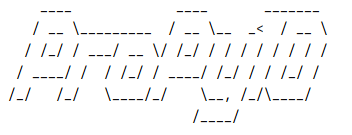

# PERSONAL ASSISTANT


## About

PERSONAL ASSISTANT is a console application.

The console application uses a command line interface.
This application has a specific set of commands. 
A list of all commands and their syntax can be found **[here](./help_comands.md)**.<br>

***PERSONAL ASSISTANT*** has three main areas:
- Working with contacts (address book)
- Working with notes
- Working with files and folders (their sorting)

## Documentation


### Possibilities:<br>
1. The contact book has the following functionality:<br>
    * creating a contact card (name, phone number, birthday, email, address)
    * adding a phone number
    * change contact card
    * deleting the entire contact card or a specific field<br>
   ```
   The program can prompt the user for commands in case of incorrect input.
   ```
2. Notes:<br>
    * creating a note (Name, text of the note itself, tags - if necessary)
    * search for a note by title, text, tags
    * note editing
    * deleting a note<br>
   <br>
3. File editor:<br>
   * folder creation
   * unzipping files
   * sorting files into folders according to their extension<br>
   <br>
   To correctly save contacts and notes, you must stop the program
   only with built-in commands: exit, close, good bye.<br>
   All information will be saved automatically.

## Developers


<br>
### [Dmitriy Fialko](https://github.com/dmitriyfialko)<br>
### [Mykhail Palkin](https://github.com/Mephod1y)<br>
### [Pavlo Hryhorenko](https://github.com/Pavlo-Hryhorenko)
### [Ruslan Stoliar](https://github.com/RuslanStoliar)<br>
### [Serhii Olkhovskyi](https://github.com/Serhii-Olkhovskyi)<br>
### [Svitlana Seleznova](https://github.com/SiaAnalyst)<br>


<br>


## License


#### Project Project-Personal_assistant is distributed under the MIT license.
